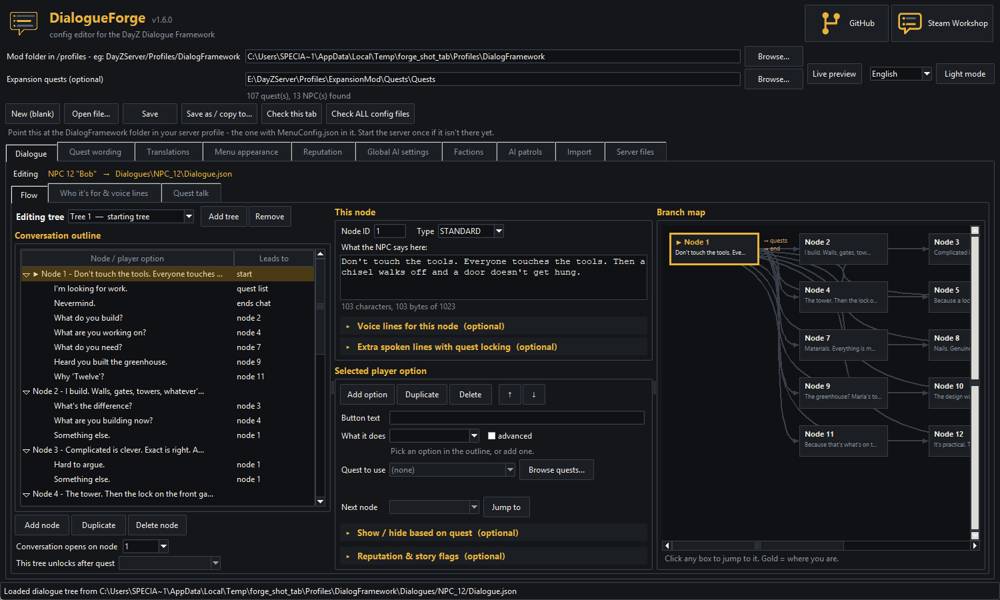
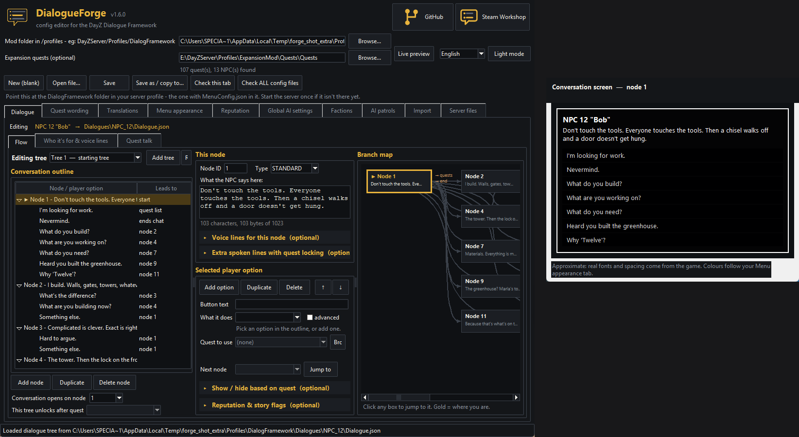
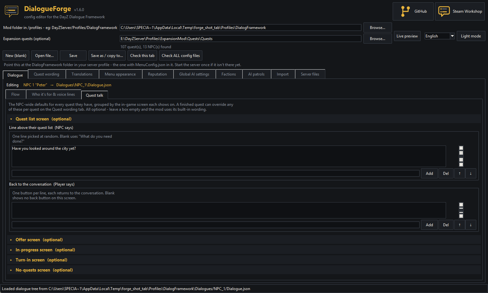
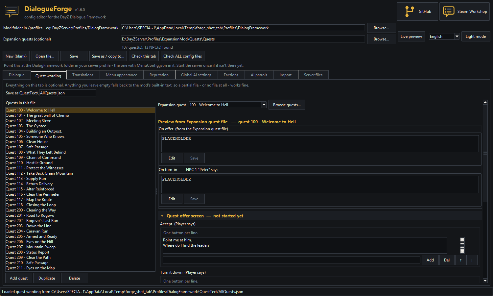
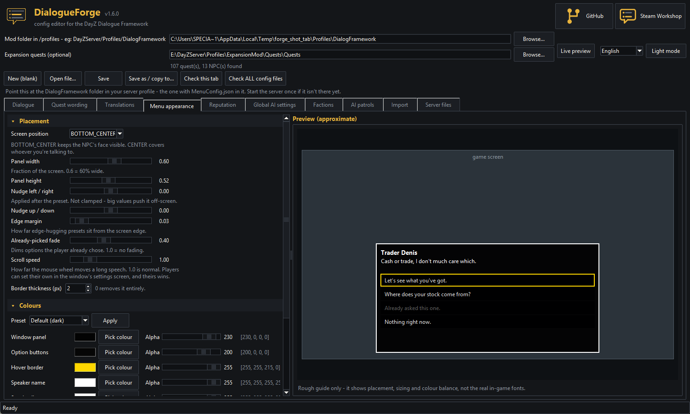
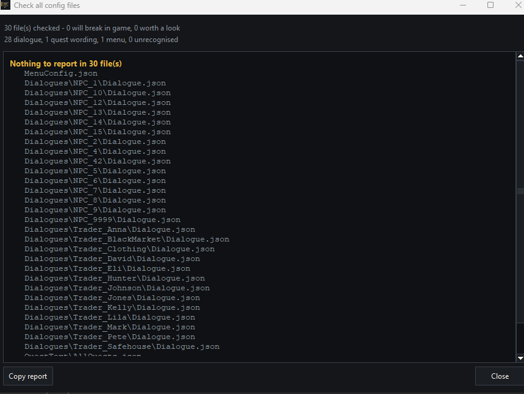
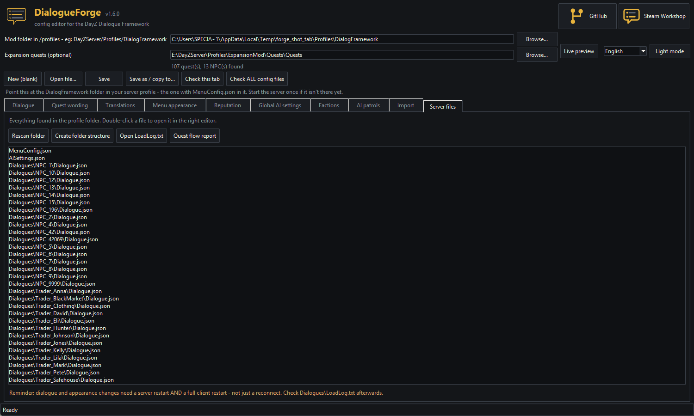

# DialogueForge

**Build NPC and trader conversations for the DayZ Dialogue Framework — without touching a single line of JSON.**

[**⬇ Download**](../../releases/latest) · [Setup guide](docs/GUIDE.md) · [Dialogue Framework on Steam](https://steamcommunity.com/sharedfiles/filedetails/?id=3767910705)

---

Writing dialogue by hand means a lot of time in a text editor, counting node
numbers and hunting for the one missing comma that stops the whole file
loading. DialogueForge gives you the same files through a normal Windows
program.

No install. No coding. Download it, run it, point it at your server profile
folder.

## What it does

**Writes every config the mod uses**

Dialogue trees for quest NPCs, traders and shared conversations, per-quest
wording, and the menu appearance — all from one window.

**Shows you the shape of the conversation**

The branch map draws your whole conversation as connected boxes. The one
you're editing glows gold, so you always know where you are. Click any box to
jump to it.

**Shows you the menu as you type**

The live preview draws the actual in-game screen for whatever you're editing,
using your colours and your font style. More on this below.

**Catches mistakes before your players do**

One button checks every config in your folder and tells you, in plain English,
what will break. Dead ends, options nobody can ever see, two files fighting
over the same NPC.

**Picks quests by name**

Point it at your Expansion quests folder once and every quest field becomes a
dropdown of real names. No more digging through files for an ID number.

**Translates your dialogue**

Pick a language, work down a list of every line in the conversation, type the
translation next to the original. Your conversation files aren't touched —
translations save alongside them, and anything you leave blank shows your own
wording in game, so you can ship a language before it's finished. The editor's
own interface switches language too.

---

## Live preview

Click **Live preview** and a second window opens. Put it on another monitor and
leave it there — it redraws as you type.

It isn't a generic mock-up. It uses **your** colours, window size and font
style from the Menu appearance tab, so what you see is what your server looks
like. If hint icons are on, it draws those too, using the same rule the mod
does — so an option that closes the menu shows the exit icon before a player
ever clicks it.

**On the quest wording tab it follows your cursor.** Click into the accept
buttons and it shows the quest offer screen. Click into the turn-in fields and
it switches to the hand-in screen. Click into the no-quests wording and it
shows that step, with your buttons under it. You never have to guess where a
line ends up.

---

## A look around

### Dialogue

Three pages. **Flow** for the conversation itself, **Who it's for & voice
lines** for targeting and audio, and **Quest talk** for what this NPC says
around their quest list.

### Quest talk

The NPC-wide defaults for every quest this NPC has, grouped by the in-game
screen each shows on and folded into dropdowns you open as needed. All
optional:

- **Quest list screen** — the line above their quest list, replacing the mod's
  built-in *"What do you need done?"*, plus a back-to-conversation button
- **Offer, in-progress and turn-in screens** — a back-to-conversation button
  for each
- **No-quests screen** — what they say with nothing left, plus buttons that
  carry on the conversation or end it

Lines are picked at random per visit, so three or four phrasings stops a busy
NPC sounding scripted. A finished quest can override any of these per quest on
the Quest wording tab.

### Quest wording

What your NPCs say when a quest is offered, accepted, in progress or handed
in — grouped into a dropdown per in-game screen, so each one holds just that
screen's wording. Every field is labelled **(NPC says)** or **(Player says)**,
so you always know whether you're writing dialogue or a button, and each screen
has its own back-to-conversation button.

The **after this quest is completed** sections — the quest-list greeting and
the nothing-left screen — are where a chain gets its voice. Fill the greeting
in on quest 2 and the moment quest 2 is turned in, that becomes what the NPC
says over their list, until the player finishes something later in the chain:

> *"Wall's up. Talk to Hana at the docks — she's the one hiring now."*

That's the natural place to point players at whoever hands out the next quest.
If several completed quests have wording, the highest quest ID wins, so the
chain advances on its own with no extra setup.

Anything you leave blank falls back to the mod's built-in text, so you only
fill in what you care about.

### Translations

Every line in the conversation you have open, listed with a box to type the
translation into. A counter for how many are done, a filter for what's left,
and a jump to the next gap. Saves to `Localization\<language>\` beside your
configs; your conversation files are never rewritten.

### Menu appearance

Colour pickers for every part of the window, sliders for size and position,
font presets, and the hint-icon toggle — with a live preview beside it.
Colours are always written in the right order, which removes the single most
common cause of an invisible dialogue box.

### Check everything at once

Dead node references, unreachable branches, duplicate IDs, and wording that
can never appear because nothing in the tree opens that screen.

### Quest flow report

One button writes `QuestFlow.txt` into your profile folder — every quest your
conversations mention, listed both by quest and by conversation, with the
option's own wording beside it. Look up *"what shows after quest 102?"* instead
of remembering it. It also names the mistakes you can't see in game: an option
that shows and hides on the same quest, an offer-quest option with no quest
picked, or a quest ID that isn't in your quest folder.

### Your whole setup, listed

Every config found in your profile folder. Double-click one to open it.

---

## Updating configs after a mod update

When Dialogue Framework adds new settings, `MenuConfig.json` and your quest
text files bring themselves up to date on the next server start.

**Dialogue trees don't** — on purpose. They're the files with the most work in
them, so the mod stays read-only on them and can't damage a conversation you
spent hours writing.

**Open the tree here and save it.** That writes every current field while
leaving your conversation exactly as it was. That's the whole procedure.

Nothing breaks if you skip it. An old tree keeps working — you just won't see
the newer options until you open and save it.

## Getting started

1. **[Download the latest release](../../releases/latest)** and unzip it
   anywhere.
2. Run `DialogueForge.exe`.
3. Click **Browse...** and pick the `DialogFramework` folder inside your
   server profile — the one with `MenuConfig.json` in it. Start your server
   once first if that folder doesn't exist yet.

That's it. The **Server files** tab now lists everything you have, and
double-clicking a file opens it.

> **Windows will show a blue "Windows protected your PC" box the first time.**
> That happens with any small free tool that isn't signed with an expensive
> certificate. Click **More info**, then **Run anyway**. If you'd rather not
> take my word for it, all the source is in this repo and you can build it
> yourself with `build_exe.bat`.

**After saving anything:** restart your server, then fully close and reopen
your game — a reconnect isn't enough. Then check `Dialogues\LoadLog.txt`;
there's a button for it on the Server files tab.

## Needs

- Windows 10 or 11
- The [Dialogue Framework](https://steamcommunity.com/sharedfiles/filedetails/?id=3767910705) mod on your server

Nothing else. No runtime, no install, no dependencies.

## Help and guides

- **[Setup guide](docs/GUIDE.md)** — every tab, explained
- **Something wrong?** [Open an issue](../../issues) and say what you were
  doing and what happened.

## Credits

Made for the DayZ Dialogue Framework by [ABTT-ESK](https://github.com/ABTT-ESK).

Released under the MIT licence — see [LICENSE](LICENSE).
